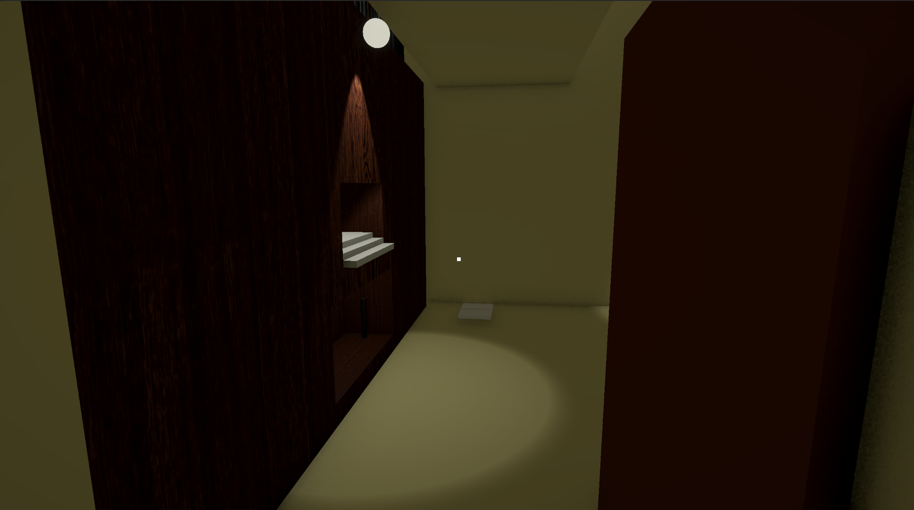
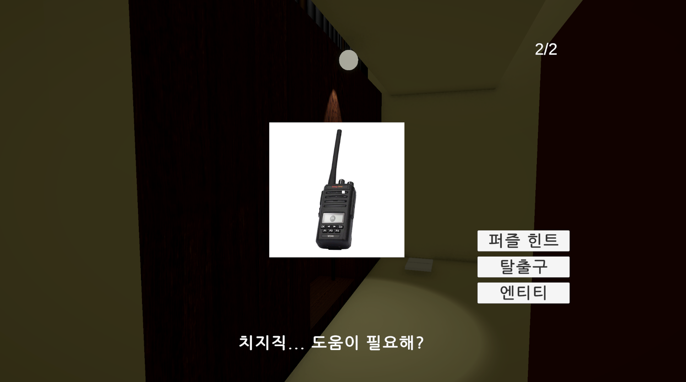
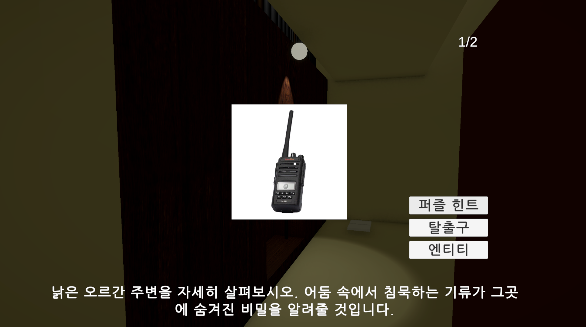
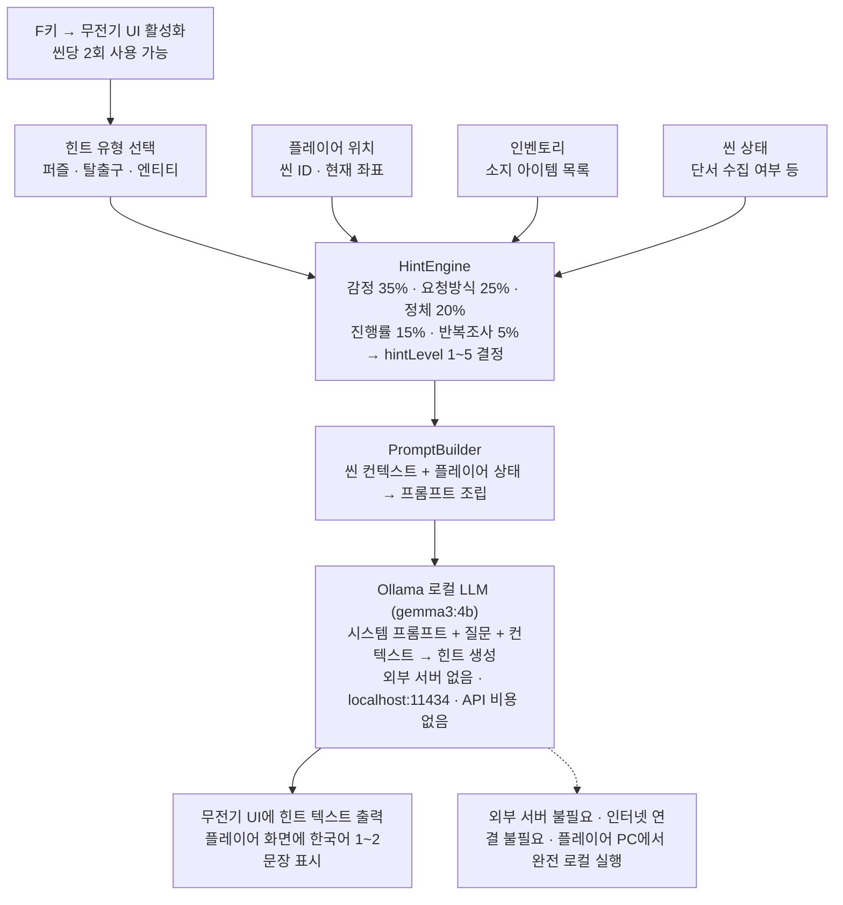

<div align="center">
  
<br/>


# Do not open this box.

### 상자를 열면 기이한 현상이 일어나는 골동품 상점에서 탈출하는 생존형 공포 게임.


<br/>

2026-1학기 캡스톤 디자인과 창업 프로젝트 | **팀 규교굥 (Team 5)**  

지도교수 : 윤명국 교수님 | 이화여자대학교 컴퓨터공학과

<br/>

[](https://www.youtube.com/watch?v=JZrWJRSucn8)
[](Self_demo.md)
[](AI_TRANSPARENCY.md)
[](experiments/ollama-experiments/README.md)

</div>

---

## Contents

- [게임 소개](#게임-소개)
- [주요 기능](#주요-기능)
- [스크린샷](#스크린샷)
- [AI 힌트 시스템](#ai-힌트-시스템)
- [설치 및 실행 방법](#설치-및-실행-방법)
- [기술 소개](#기술-소개)
- [시스템 구조](#시스템-구조)
- [레포지토리 구조](#레포지토리-구조)
- [AI 생성 콘텐츠 사용 공개](#ai-생성-콘텐츠-사용-공개)
- [팀원 소개](#팀원-소개)
---

# 게임 소개

## 📦"금지된 상자, 당신이라면 상자를 여시겠습니까?"
당신에겐 할머니께서 남기신 골동품 상점이 있습니다.<br/>
그곳엔 한 오래된 신비로운 상자가 있습니다.<br/>
그리고 유일한 규칙.<br/>
**"무슨 일 있어도 그 상자를 열어보면 안 돼."**<br/>
할머니께서는 마지막까지도 그 사실을 당부하셨습니다.<br/>
당신은 이 상자를 여시겠습니까?


## 🔑"상자 안에 남은 마지막 희망, 탈출구를 찾으세요."
금지된 상자가 열린 순간, 상점 안의 모든 규칙과 상식은 산산조각 났습니다.<br/>
기괴한 환영, 스스로 움직이는 골동품, 그리고 당신을 위협하는 존재들.<br/>
판도라의 상자에서 빠져나온 재앙들이 당신을 향해 손을 뻗습니다.<br/>
이제 당신은 이 끔찍한 공간에서 살아남아야 합니다.<br/>
숨겨진 퍼즐을 풀고, 곳곳에 깔린 함정을 피해 탈출구를 찾아내세요.<br/>
가장 절망적인 상황에서 탈출한 끝에, 당신은 희망을 맞이할 것입니다.

<br/>

---

# 주요 기능

## 🤖 AI 힌트 시스템
- 플레이어의 체류 시간, 실패 횟수, 발견 단서를 실시간 분석해 hintLevel 1~5 결정
- Ollama(gemma3:4b) 로컬 LLM이 씬 컨텍스트 기반 한국어 힌트 1~2문장 생성
- 씬당 2회 사용 제한, 외부 서버 없이 완전 로컬 실행

## 🎮 게임 시스템
- **상자 개봉 이벤트**: 금지된 상자를 여는 순간 공포 이벤트 트리거, 이후 모든 씬에 이상현상 발생
- **퍼즐 기믹 6종**: 각 스테이지마다 고유한 퍼즐 구조 (와인잔 얼룩 교차점, 오르간 수리 및 연주 등)
- **아이템 획득 및 사용**: 레이캐스트 기반 상호작용으로 단서 수집, 열쇠 사용, 탈출 아이템을 상자에 배치
- **엔티티 시스템**: 씬별 배회하는 공포 엔티티, 소리 감지 및 추격 패턴 구현
- **탈출 구조**: 퍼즐 완료 → 탈출 아이템 획득 → 상자에 배치 → 출구 개방의 6단계 순차 진행
<br/>

---
# 스크린샷

| 게임 플레이 | AI 힌트 UI | AI 힌트 생성 중 |
|:-----------:|:----------:|:--------------:|
|  |  |  |

---

# 데모 영상

[데모 영상 보기](https://www.youtube.com/watch?v=JZrWJRSucn8)
https://www.youtube.com/watch?v=JZrWJRSucn8

---

# AI 생성 콘텐츠 사용 공개

- 이 게임에 사용된 일부 그래픽 에셋은 AI를 사용해 만들어졌습니다.
- 게임 플레이 중 AI는 플레이어의 진행 기록을 바탕으로 일부 텍스트를 생성합니다.

<br/>

---

# 설치 및 실행 방법

## 실행 환경

| 항목 | 요구 사항 |
|------|----------|
| Unity 버전 | 6000.3.11f1 |
| 운영체제 | Windows 10 이상 / macOS 12 이상 |
| AI 런타임 | [Ollama](https://ollama.com) (gemma3:4b 모델) |

## ▶ 빠른 시작 (빌드 파일 실행)

1. GitHub 상단 `Code → Download ZIP` 또는 `Builds` 폴더만 다운로드
```bash
svn export https://github.com/muffinhead03/Start2026_1/trunk/Builds
```
2. Ollama 설치 후 모델 다운로드 (최초 1회, 약 2.5GB)
```bash
ollama pull gemma3:4b
```
3. Ollama 실행
```bash
ollama run gemma3:4b
```
4. 운영체제에 맞는 실행 파일 실행
   - Windows: `Builds/Start2026_1.exe`
   - macOS: `Builds/Start2026_1.app`

> ⚠️ `Start2026_1_Data` 폴더와 실행 파일이 반드시 같은 경로에 있어야 합니다.  
> ⚠️ Ollama가 실행되지 않은 상태에서는 무전기 힌트 기능을 사용할 수 없습니다.

처음 실행하는 분은 [Self_demo.md](Self_demo.md)를 참고하세요.

## 🛠 개발 환경에서 실행 (Unity Editor)

```bash
git clone https://github.com/muffinhead03/Start2026_1.git
```

1. Unity Hub → `Add` → 클론한 폴더 선택
2. Unity **6000.3.11f1** 버전으로 열기 (버전 불일치 시 렌더링 오류 발생 가능)
3. `Assets/Scenes/BeforeGame/StartingScene.unity` 를 열고 Play
4. AI 힌트 시스템 사용 시 Ollama가 백그라운드에서 실행 중이어야 함

```bash
ollama pull gemma3:4b   # 최초 1회
ollama run gemma3:4b    # 게임 실행 전 매번
```

<br/>


---

# 기술 소개

| Category | Tech Stack |
| :--- | :--- |
| **Engine** |  |
| **Language** |  |
| **AI** |  |
| **Platform** |   |
| **Rendering** |  |

<br/>

---

# 시스템 구조


플레이어가 무전기로 힌트를 요청하면 Unity가 로컬 Ollama 서버에 HTTP 요청을 보냅니다.
플레이어의 진행 상황(체류 시간, 발견 단서, 실패 횟수)을 분석해 1~5단계 맞춤형 힌트를 생성합니다.



---

# AI 힌트 시스템

플레이어가 무전기(F키)로 힌트를 요청하면, 4단계 파이프라인을 거쳐 상황에 맞는 힌트가 생성됩니다.

### 힌트 레벨 결정 로직
`HintEngine`이 플레이어 상태(`PlayerState`)를 5가지 지표로 분석해 가중합산 점수를 계산하고, 점수에 따라 `hintLevel 1~5`를 결정합니다. 레벨이 높을수록 직접적인 힌트를 제공합니다.
| 지표 | 가중치 | 주요 판단 기준 |
|------|:------:|--------------|
| 감정 점수 (체류 시간 + 힌트 횟수 + 실패 횟수) | **35%** | 플레이어 답답함 추정 |
| 힌트 요청 방식 (direct / indirect) | **25%** | 플레이어가 직접 힌트를 선택했는지 여부 |
| 정체 점수 (실패 횟수 + 체류 시간) | **20%** | 같은 자리에서 막힌 정도 |
| 진행률 (완료 단계 / 전체 단계) | **15%** | 남은 퍼즐 단계 비율 |
| 반복 조사 횟수 | **5%** | 같은 오브젝트를 3회 이상 반복 조사 |

**레벨 구간**

| 점수 범위 | 힌트 레벨 |
|:--------:|:--------:|
| 0 ~ 2 미만 | Level 1 (가장 간접적) |
| 2 ~ 3 미만 | Level 2 |
| 3 ~ 4 미만 | Level 3 |
| 4 ~ 5 미만 | Level 4 |
| 5 이상 | Level 5 (가장 직접적) |

> 모델 선정 과정 및 실험 결과 → [experiments/ollama-experiments/README.md](experiments/ollama-experiments/README.md)

# 레포지토리 구조

```text
📂 Start2026_1/
├── 📂 .github/                           # GitHub 협업 설정
│   ├── 📂 ISSUE_TEMPLATE/                # 이슈 템플릿 (버그/기능 제안)
│   └── pull_request_template.md          # PR 템플릿
├── 📂 Assets/                            # 유니티 프로젝트 에셋
│   ├── 📂 Animation/                     # 애니메이션 클립 및 컨트롤러
│   ├── 📂 ArtSource/                     # 아트 원본 소스 파일
│   ├── 📂 BlenderAssetTest/              # 블렌더 에셋 연동 테스트 폴더
│   ├── 📂 FontCollector/                 # 폰트 리소스 모음
│   ├── 📂 Material/                      # 3D 모델 머티리얼 및 텍스처
│   ├── 📂 Meshes/                        # 3D 메시 파일
│   ├── 📂 MobileDependencyResolver/      # 모바일/외부 패키지 종속성 관리
│   ├── 📂 Music/                         # 배경음악 및 오디오 파일
│   ├── 📂 Prefabs/                       # 게임 내 재사용 가능한 프리팹 오브젝트
│   ├── 📂 Resources/                     # 런타임 동적 로드용 리소스
│   ├── 📂 Scenes/                        # 게임 씬
│   ├── 📂 Scripts/                       # C# 스크립트
│   │   └── 📂 AI_test/                   # AI 힌트 시스템 (HintManager 등)
│   ├── 📂 Settings/                      # 유니티 환경 및 렌더링 설정 (URP 등)
│   ├── 📂 Sounds/                        # 효과음 파일
│   ├── 📂 TextMesh Pro/                  # TextMesh Pro 폰트 및 설정
│   ├── 📂 TimeLine/                      # 타임라인 애니메이션 데이터
│   └── 📂 _Recovery/                     # 복구용 백업 파일
├── 📂 BlenderPractice/                   # 블렌더 3D 모델링 작업 및 연습 파일
├── 📂 doc/                               # 프로젝트 관련 문서 및 발표 자료
├── 📂 experiments/
│   └── 📂 ollama-experiments/            # Ollama AI 힌트 시스템 실험 및 결과 데이터
│       ├── README.md                     # 실험 개요 및 모델 비교 결과
│       ├── 📂 prompts/                   # 버전별 시스템 프롬프트 기록
│       └── 📂 results/                   # 씬/케이스별 응답 로그
├── 📂 images/                            # README에 사용되는 이미지 파일
├── 📂 Packages/                          # 유니티 패키지
├── 📂 ProjectSettings/                   # 유니티 프로젝트 설정
├── AI_TRANSPARENCY.md                    # AI 투명성 리포트
├── INDUSTRY_TRACK.md                     # 경쟁 게임 분석 및 차별점 정리
├── Ideation.MD                           # 게임 기획 및 아이디어 정리 문서
├── ProjectDescription.md                 # 프로젝트 상세 설명 문서
├── README.md                             # 레포지토리 메인 소개 문서
├── Self_demo.md                          # 게임 시연 가이드
├── Start2026_1.slnx                      # 프로젝트 솔루션 파일
├── index.html                            # 웹 호스팅용 메인 인덱스 페이지
└── Team_Ground_Rule.md                   # 팀 협업 규칙 및 그라운드 룰 문서
```

<br/>


# 팀원 소개
[](https://github.com/muffinhead03/Start2026_1/graphs/contributors)

| 이름 | 역할 |
|------|------|
| 정혜교 | PM, Unity 씬 개발, Blender 3D 에셋 제작 |
| 윤민주 | 기획, Unity 씬 개발, 레벨 디자인 |
| 박남규 | AI 힌트 시스템 개발, Unity 씬 개발 |
<br/>

---

# AI 투명성 리포트

| AI 도구 | 활용 내역 | 인간 검수 여부 |
|---------|----------|--------------|
| Claude | 힌트 시스템 스크립트 초안 작성 (HintManager, PromptBuilder 등) | ✅ 팀원이 직접 검토 후 수정 |
| ChatGPT | 기획 보조, 문서 초안 작성 | ✅ 팀원이 직접 검토 후 수정 |
| Ollama (gemma3:4b) | 게임 내 플레이어 맞춤형 힌트 실시간 생성 | ✅ 프롬프트 설계 및 결과 검증 |
| Blender AI 기능 | 일부 3D 에셋 생성 보조 | ✅ 팀원이 직접 수정 |

> AI 출력물은 모두 팀원이 직접 검토하고 수정했습니다.
> 핵심 게임 로직, 퍼즐 설계, 레벨 디자인은 팀원이 직접 구현했습니다.
> 수정·거부 사례 및 신뢰 이슈 포함 전체 내용 → [AI_TRANSPARENCY.md](AI_TRANSPARENCY.md)
