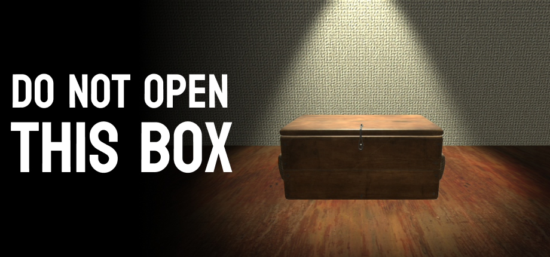
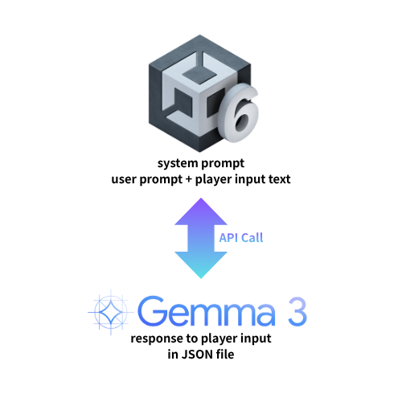

<div align="center">
  
<br/>



# Do not open this box.

### 상자를 열면 기이한 현상이 일어나는 골동품 상점에서 탈출하는 생존형 공포 게임.


<br/>

2026-1학기 캡스톤 디자인과 창업 프로젝트 | **팀 규교굥 (Team 5)**
지도교수 : 윤명국 교수님 | 이화여자대학교 컴퓨터공학과

<br/>

</div>

---

# 게임 소개

## 📦"금지된 상자, 당신이라면 상자를 여시겠습니까?"
당신에겐 할머니께서 남기신 골동품 상점이 있습니다.<br/>
그곳엔 한 오래된 신비로운 상자가 있습니다.<br/>
그리고 유일한 규칙.<br/>
**"무슨 일 있어도 그 상자를 열어보면 안 돼."**<br/>
할머니께서는 마지막까지도 그 사실을 당부하셨습니다.<br/>
당신은 이 상자를 여시겠습니까?


## 🔑"상자 안에 남은 마지막 희망, 탈출구를 찾으세요."
금지된 상자가 열린 순간, 상점 안의 모든 규칙과 상식은 산산조각 났습니다.<br/>
기괴한 환영, 스스로 움직이는 골동품, 그리고 당신을 위협하는 존재들.<br/>
판도라의 상자에서 빠져나온 재앙들이 당신을 향해 손을 뻗습니다.<br/>
이제 당신은 이 끔찍한 공간에서 살아남아야 합니다.<br/>
숨겨진 퍼즐을 풀고, 곳곳에 깔린 함정을 피해 탈출구를 찾아내세요.<br/>
가장 절망적인 상황에서 탈출한 끝에, 당신은 희망을 맞이할 것입니다.

<br/>

---

# 주요 기능

- **플레이어별 맞춤형 AI 힌트 제공:** 플레이어의 스테이지 진행 상황에 따라 Ollama를 활용한 텍스트 형식의 힌트 생성.
- **6가지 탈출 맵과 기믹:** 총 6가지 스테이지가 있으며 각 스테이지마다 다른 기믹과 상호작용을 구현.
<br/>

---

# AI 생성 콘텐츠 사용 공개

- 이 게임에 사용된 일부 그래픽 에셋은 AI를 사용해 만들어졌습니다.
- 게임 플레이 중 AI는 플레이어의 진행 기록을 바탕으로 일부 텍스트를 생성합니다.

<br/>

---
# 설치 및 실행 방법
해당 레포지토리 첫 페이지에서 BuildFile 폴더로 들어간다. 
다운로드를 하면 OOO 파일을 연다


---

# 기술 소개

| Category | Tech Stack |
| :--- | :--- |
| **Engine** |  |
| **Language** |  |
| **AI** |  |
| **Platform** |   |
| **Rendering** |  |

<br/>

---

# 시스템 구조



# 레포지토리 구조

```text
📂 Start2026_1/
├── 📂 Assets/                            # 유니티 프로젝트 에셋
│   ├── 📂 Animation/                     # 애니메이션 클립 및 컨트롤러
│   ├── 📂 BlenderAssetTest/              # 블렌더 에셋 연동 테스트 폴더
│   ├── 📂 Material/                      # 3D 모델 머티리얼 및 텍스처
│   ├── 📂 MobileDependencyResolver/      # 모바일/외부 패키지 종속성 관리
│   ├── 📂 Prefabs/                       # 게임 내 재사용 가능한 프리팹 오브젝트
│   ├── 📂 Resources/                     # 런타임 동적 로드용 리소스
│   ├── 📂 Scenes/                        # 게임 씬
│   ├── 📂 Scripts/                       # C# 스크립트
│   ├── 📂 Settings/                      # 유니티 환경 및 렌더링 설정 (URP 등)
│   └── 📂 TutorialInfo/                  # 유니티 튜토리얼 관련 데이터
├── 📂 BlenderPractice/                   # 블렌더 3D 모델링 작업 및 연습 파일
├── 📂 BuildFile/                         # 빌드할 결과 파일을 저장할 곳
├── 📂 Packages/                          # 유니티 패키지
├── 📂 ProjectSettings/                   # 유니티 프로젝트 설정
├── 📂 experiments/
│   └── 📂 ollama-negotiation/            # Ollama AI 기반 시스템 테스트 및 실험 데이터
├── 📂 images/                            # README에 사용되는 이미지 파일
├── Ideation.MD                            # 게임 기획 및 아이디어 정리 문서
├── ProjectDescription.md                  # 프로젝트 상세 설명 문서
├── README.md                              # 레포지토리 메인 소개 문서
├── Start2026_1.slnx                       # 프로젝트 솔루션 파일
├── Team_Ground_Rule.md                    # 팀 협업 규칙 및 그라운드 룰 문서
└── index.html                             # 웹 호스팅용 메인 인덱스 페이지
